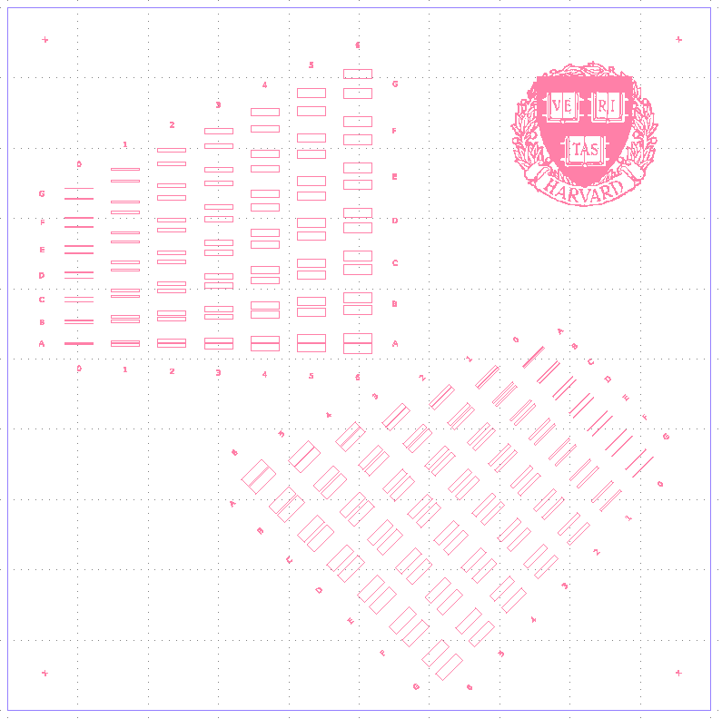

# SIVIDL Nanophotonics GDS Layout Editor

The SIVIDL module is an extension to the fabulous [PHIDL](https://github.com/amccaugh/phidl) package.

# Setup and Requirements

To install the requirements, use `pip`:

`pip install -r requirements.txt`

# Example

The file `example.py` can be used to gain an understanding of the implemented classes. It will generate two arrays containing two-dimensional parameter sweeps of a device:

